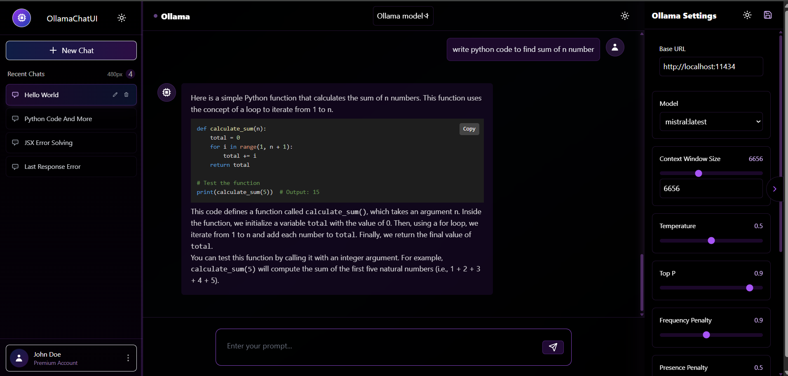

# Ollama Chat UI

A simple chat UI built using **Ollama** for interactive and conversational AI experiences.

## 🚀 Features

- **Real-time chat** powered by Ollama AI.
- **Interactive UI** for smooth user experience.
- **Lightweight and easy to use**.
- **Fully responsive** for different screen sizes.

## 📸 Demo

  

## 🛠️ Installation

### Prerequisites

Before you begin, make sure you have the following installed:

- [Node.js](https://nodejs.org/) (Version 14 or above)
- [npm](https://npmjs.com) (Package manager for Node.js)

### Steps to Install

1. Clone the repository:

   ```bash
   git clone https://github.com/yourusername/ollama-chat-ui.git
   cd ollama-chat-ui
   ```
1. Install dependencies:
  ```bash
   npm install
  ```
1. Run the project:
   ```bash
   npm run dev
   ```


## 🤝 Contributing

We love contributions from the community! Whether it's fixing bugs, improving the documentation, or adding new features,
